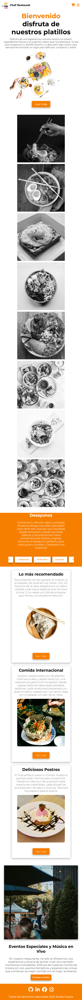
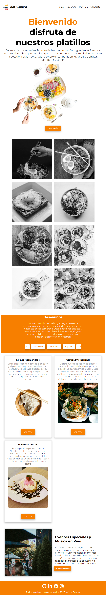
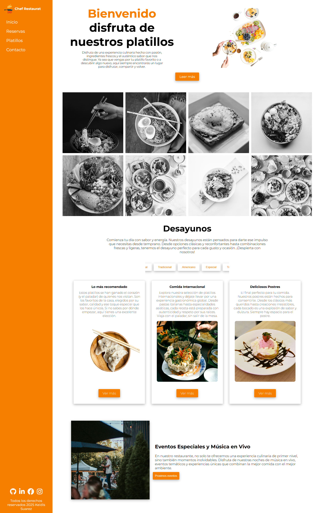

---

## 📱 Diseño Responsive Css avanzado

El diseño está optimizado para distintos dispositivos, incluyendo:

- Teléfonos móviles
- Tablets
- Escritorios y laptops

Se aplicaron **media queries** para asegurar una experiencia de usuario fluida y agradable en todos los tamaños de pantalla.

---

## 💡 Características Destacadas

- Layout principal con **Grid CSS**
- Menú de navegación adaptativo con **Flexbox**
- Efectos de hover con **transiciones suaves**
- Animaciones
- Semántica HTML respetando buenas prácticas
- Código limpio y comentado para facilitar mantenimiento

---

## 📸 Capturas de Pantalla

---

## 🚀 Cómo visualizar el proyecto

Puedes abrir el archivo `index.html` directamente desde tu navegador  en vivo publicado en  GitHub Pages:

---

## 🧑‍💻 Autor

Desarrollado por: **[Keidis Suarez]**

---

¡Gracias por visitar este proyecto! Si te gusta, no olvides dejar una ⭐ en el repositorio.
